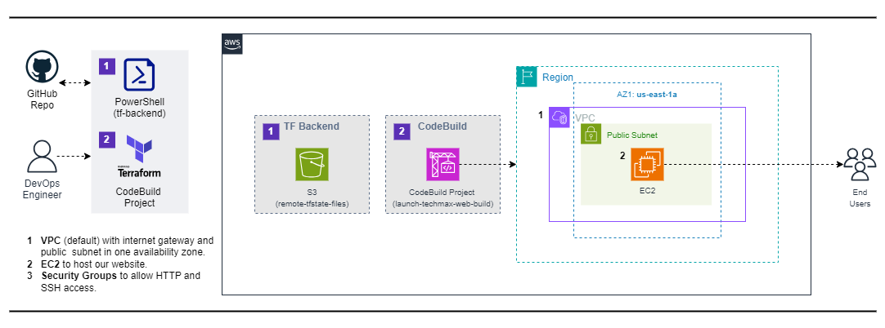

# Automatically Apply Terraform With AWS CodeBuild

## Overview

This project demonstrates how to automatically apply terraform projects using aws CodeBuild. The setup includes the following components: VPC and EC2.

## Reference Diagram

## Project Components

1. **VPC**: Default Virtual Private Cloud with subnet.
2. **EC2**: To serve the Techmax Web.
3. **Security Groups**: To allow HTTP and SSH access.

## Prerequisites
Before you begin, ensure you have the following:

- An AWS account with appropriate permissions.
- Terraform installed on your local machine.

### Notes

- Ensure that you have the necessary AWS credentials configured on your system for Terraform to authenticate with AWS.
- Review the Terraform configuration files to understand the resource provisioning process.
- Customize Terraform scripts and configurations as needed for your specific requirements.
- Ensure proper IAM permissions and security measures are in place for managing AWS resources securely.

## Deployment Steps
1. Go to D:\GitHub\Terraform\AWS\055-cicd-automatically-apply-terraform-deployments-with-aws-codebuild
2. Run "./scripts/01-prereq-tf-backend.ps1" to create s3 bucket ("remote-tfstate-files")
3. Change value of the secret.tfvars
4. Go to D:\GitHub\Terraform\AWS\055-cicd-automatically-apply-terraform-deployments-with-aws-codebuild\tf-codebuild
5. Run terraform init/apply -var-file="secret.tfvars" -auto-approve
6. Go to aws console (CodeBuild > Build projects > launch-techmax-web-build then run "Start build"
7. Check resources created and if web site is running 

## To cleanup:
1. Go to ./cicd/03-apply-terraform.sh and swap # between terraform apply and terraform destroy. Save and push to GitHub. 
2. On aws console (CodeBuild > Build projects > launch-techmax-web-build then run "Start build"
3. Confirm if Build run succeeded. (Under EC2, techmax server should have a Terminated state).
4. Go to D:\GitHub\Terraform\AWS\055-cicd-automatically-apply-terraform-deployments-with-aws-codebuild\tf-codebuild.
5. Apply terraform destroy -var-file="secret.tfvars" -auto-approve
6. Run ..\scripts\02-post-tf-cleanup.ps1 to delete s3 bucket ("remote-tfstate-files")

## Resources

- [Terraform Documentation](https://www.terraform.io/docs/index.html)
- [AWS CodeBuild](https://docs.aws.amazon.com/codebuild/)

---

This README provides a structured overview of the project, outlines the necessary components, prerequisites, and steps to deploy and manage a website on AWS with CodeBuild and Terraform.