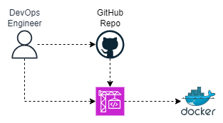

# Build and Push Docker Image to Docker Hub with AWS CodeBuild


## Overview

This project demonstrates how to build a docker image and push it to the dockerhub automatically using AWS CodeBuild. The setup includes the following components: CodeBuild and GitHUb.


## Reference Diagram




## Project Components

1. **CodeBuild**: automates the process of turning our source code into an application.
1. **Github**: stores and track changes to our codes.


## Prerequisites
Before you begin, ensure you have the following:

- An AWS account with appropriate permissions.


## Deployment Steps
1. Go to AWS Console > Developer Tools > CodeBuild > Build projects then select "Create project"
2. Update details below:

    - Project name: cicd-build-docker-image
    - Description: Build project to build docker image and push it to dcker hub
    - Source provider: Github (COnnect with a GitHub personal access token)
    - Github Repository: https://github.com/arnoldben/055-cicd-automatically-apply-terraform-deployments-with-aws-codebuild.git
    - Privileged: Check Enable this flag if you want to build Docker images or want your builds to get elevated privileges.
    - Environment variables:
    
        ```
        IMAGE_TAG = techmax
        DOCKER_HUB_USERNAME = arnoldben
        DOCKER_HUB_PASSWORD = docker_06Nov1980
        DOCKER_HUB_REPO_NAME = techmax-as
    
     
        IMAGE_TAG = jupiter
        DOCKER_HUB_USERNAME = arnoldben
        DOCKER_HUB_PASSWORD = docker_06Nov1980
        DOCKER_HUB_REPO_NAME = jupiter-as
        ```
    
    - Build Specifications: Use a buildspec file
    
3. Select "Start build"
4. Check if docker image is successfully pushed to docker hub. 


## Resources

- [AWS CodeBuild](https://docs.aws.amazon.com/codebuild/)
- [Docker Documentation](https://docs.docker.com/)
    

---

This README provides a structured overview of the project, outlines the necessary components, prerequisites, and steps to Build and push Docker Image to Dockerhub with AWS CodeBuild.