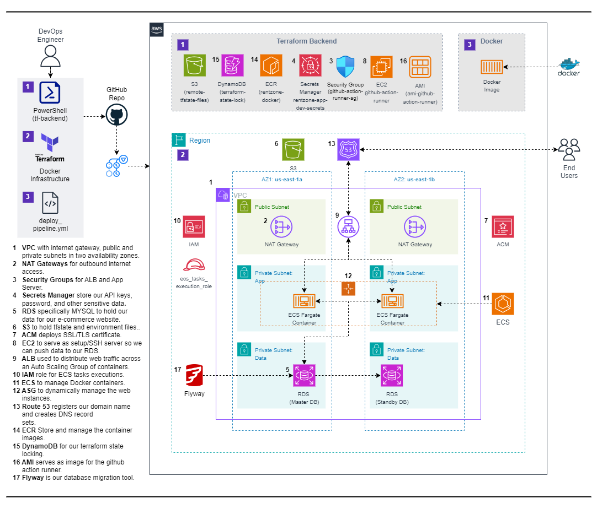

# Deploy a Dynamic Car Rental Web App on AWS with Docker and GitHub Actions


## Overview
This project demontrates how to deploy a dynamic web application on AWS with Docker and Github ACtions. The setup includes the following components: VPC, RDS, S3, ACM, EC2, ALB, IAM, ECS, ASG, R53, GitHub ans Flyway.


## Reference Diagram




## Project Components

1. **VPC**: Virtual Private Cloud with internet gateway, public and private subnets in two availability zones.
2. **NAT Gateways**: For outbound internet access.
3. **Security Groups**: For ALB and App Server.
4. **RDS**: To hold our data for our website
5. **S3**: To hold the web files and scripts.
6. **ACM**: AWS Certificate Manager to deploy SSL/TLS certificate.
7. **EC2**: To serve as setup/ssh server so we can push data to our RDS.
8. **ALB**: Application Load Balancer used to distribute web traffic across an Auto Scaling Group of containers.
9. **IAM**: Role for ECS tasks executions.
10. **ECS**: Elastic Container Service for running Docker containers.
11. **ASG**: Auto Scaling Group to dynamically manage EC2 web instances.
12. **Route 53**: Registers our domain name and creates DNS record sets.


## Prerequisites

Before you begin, ensure you have the following:

- An AWS account with appropriate permissions.
- Terraform installed on your local machine.


### Notes

- Ensure that you have the necessary AWS credentials configured on your system for Terraform to authenticate with AWS.
- Review the Terraform configuration files to understand the resource provisioning process.
- Refer to the official Terraform documentation for more information on configuring AWS resources using Terraform.


## Deployment Steps

1. On your C:\Users\Arnold\.aws\credentials file, update your access key id and Secret access key
2. Update terraform.tfvars (route 53)
3. Create s3 bucket, dynamodb table and ecr repo

```
05-prereq-rentzone-docker-github-actions.ps1
```

4. Update github secrets on github:

    AWS_ACCESS_KEY_ID:
    AWS_SECRET_ACCESS_KEY:
    ECR_REGISTRY:
    PERSONAL_ACCESS_TOKEN:
    RDS_DB_NAME: applicationdb    
    RDS_DB_USERNAME: admin
    RDS_DB_PASSWORD: admin123

5. Update TERRAFORM_ACTION (Line 11) and ec2-image-id (Line 203) on deploy_pipeline.yml. Deploy_pipeline will automatically be triggered via push.
6. Access site https://www.xxxxxxxxxxxx.realhandsonlabs.net


## Resources

- [Terraform Documentation](https://www.terraform.io/docs/index.html)
- [Docker Documentation](https://docs.docker.com/get-started/)
- [GitHub Actions Documentation](https://docs.github.com/en/actions)


## Additional Notes

- Customize Terraform scripts and configurations as needed for your specific requirements.
- Ensure proper IAM permissions and security measures are in place for managing AWS resources securely.

---

This README provides a structured overview of the project, outlines the necessary components, prerequisites, and steps to deploy and manage a dynamic website on AWS with Docker and GitHub Actions. The pipeline ensures a seamless and automated process for deploying applications, managing infrastructure, and performing database migrations while optimizing resource usage and maintaining security.